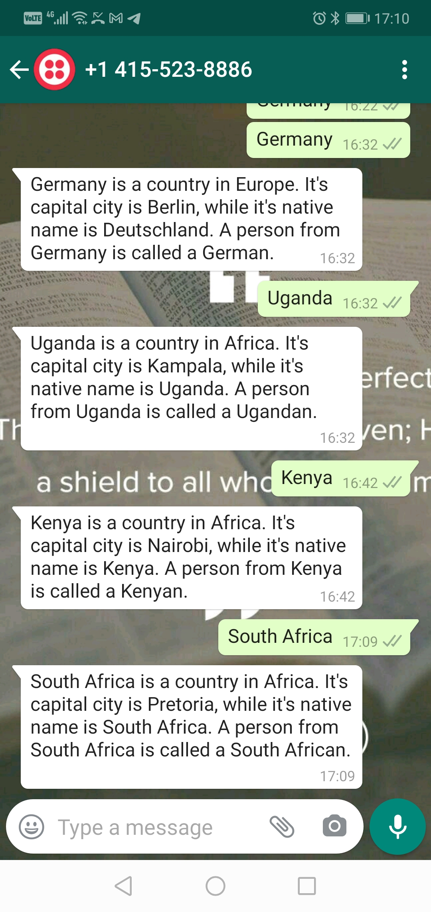

##twilio-chatbot

A Twilio chatbot project - coded for learning purposes.




## Built With

- Python
- Flask
- Twilio

#### Description

A Twilio chatbot project - coded for learning purposes by following this [tutorial](https://www.twilio.com/blog/serverless-whatsapp-chatbot-python-google-cloud-functions-twilio).

## Install dependencies
  - Type the following command in the terminal
  `pip install -r requirements.txt`
  
## Deploy Gcloud function locally

  ```
  gcloud functions deploy whatsapp_webhook --runtime python38 --trigger-http --allow-unauthenticated
  
  ```

## Authors

👤 **Marylene Sawyer**
- Github: [@Bluette1](https://github.com/Bluette1)
- Twitter: [@MaryleneSawyer](https://twitter.com/MaryleneSawyer)
- Linkedin: [Marylene Sawyer](https://www.linkedin.com/in/marylene-sawyer-b4ba1295/)


# Acknowledgements

- The content in this repository was retrieved from or inspired by the following sites
  - [Building a Serverless WhatsApp Chatbot using Python, Google Cloud Functions and Twilio](https://www.twilio.com/blog/serverless-whatsapp-chatbot-python-google-cloud-functions-twilio)
  - [Custom Responses to Incoming SMS Messages](https://www.twilio.com/docs/sms/tutorials/how-to-receive-and-reply-python#custom-responses-to-incoming-sms-messages)

## 🤝 Contributing

Contributions, issues and feature requests are welcome!
